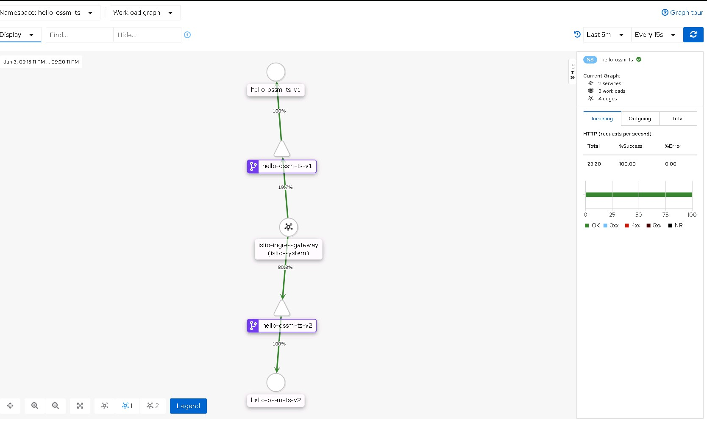

## Prerequisites.
* Service Mesh 2.x installed and running.
* Namespace enrolled properly in SMMR.

## Traffic Flow.

Client Pods (Outside Mesh) -> IngressGateway(custom svc name) -> VirtualService (80/20 split weight)

## Steps
NOTE: Remember to change parameters based on current environment configured.

1. Deploy both apps version.  
```shell
oc create -f hello-ossm-ts-v1.yaml -f hello-ossm-ts-v2.yaml
```  

2. Expose service for both deployments version.  
```shell
oc create -f hello-ossm-ts-v1-svc.yaml -f hello-ossm-ts-v2-svc.yaml
```

3. Create VirtualService and Gateway.  
```shell
oc create -f hello-ossm-ts-gw.yaml -f  hello-ossm-ts-vs.yaml
```

4. Now this the important part, in order for istio to work properly traffic must go trough ingressgateway[[1]], or else configured istio rules wont get applied to the traffic. Since this is internal cluster svc call(where the caller is not in the mesh but service called in the mesh) it`s not ideal for the caller to call the service via its route exposed on router. We can create a custom service name in the control plane namespace and point it to ingressgateway pod and use that custom service name as 'host' in the Gateway and VirtualService.


5. Now we create a new service in the control plane namespace pointing to ingressgateway.  
```shell
oc create -f hello-ossm-ts-ingressgateway.yaml
```

6. To test this, from the client pod(external to the mesh) run;

```shell
while true; do curl http://hello-ossm-ts.istio-system.svc; sleep 0.5; done
```





[1]: https://docs.openshift.com/container-platform/4.6/service_mesh/v2x/prepare-to-deploy-applications-ossm.html#ossm-config-network-policy_deploying-applications-ossm


