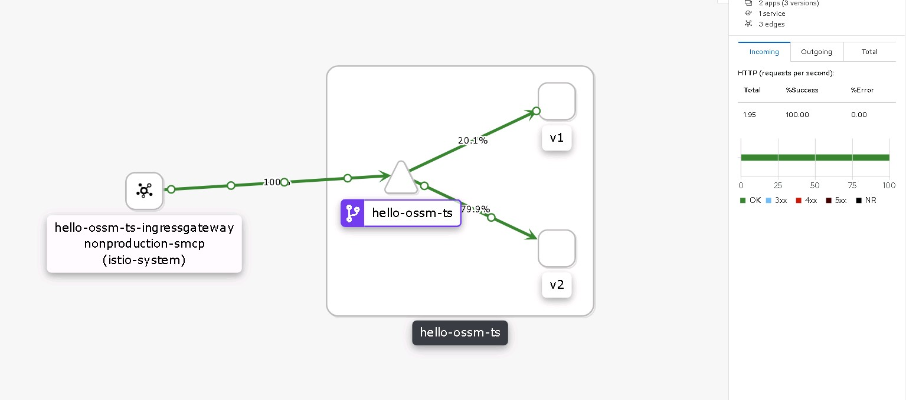
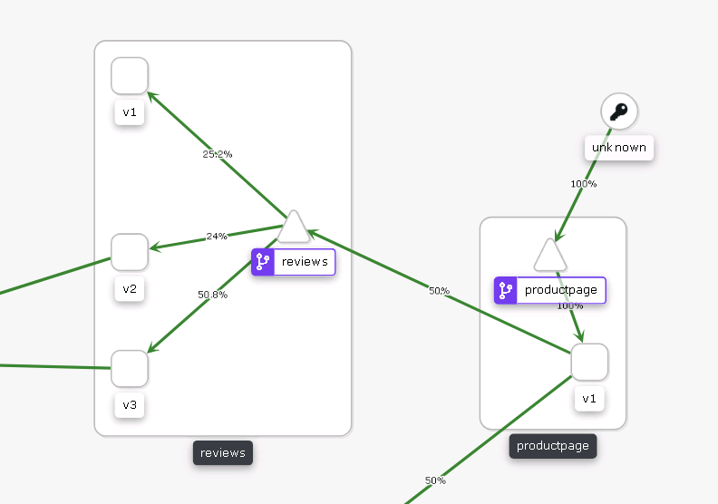

# 1. Single Service.
## Prerequisites.
* Service Mesh 2.x installed and running.
* Namespace enrolled properly in SMMR.
* Additional ingressgateway router (we are going to use this ingressgateway service fqdn as service hostname for our service later), e.g:
```yaml
    additionalIngress:
      hello-ossm-ts-ingressgateway:
        enabled: true
        runtime:
          deployment:
            autoScaling:
              enabled: true
              minReplicas: 2
              maxReplicas: 6
```

## Traffic Flow.

Client Pods (Outside Mesh) -> IngressGateway(custom svc name) -> VirtualService (80/20 split weight)

## Steps
NOTE: Remember to change parameters based on current environment configured.

1. Deploy both apps version.  
```shell
oc create -f hello-ossm-ts-v1-deploy.yaml -f hello-ossm-ts-v2-deploy.yaml
```  

2. Expose service for both deployments version.  
```shell
oc create -f hello-ossm-ts-svc.yaml
```

NOTE: This the important part, in order for istio to work properly traffic must go trough envoy proxy(in this case since we dont have any other fronting pod that has envoy, we are going to use ingressgateway as entry to the mesh so traffic are egressing from ingressgateway envoy towards hello-ossm-ts service is proxied by Envoy), or else configured istio rules wont get applied to the traffic. Since this is internal cluster svc call(where the caller is not in the mesh but service called in the mesh) it`s not ideal for the caller to call the service via its route exposed on router. We can create a custom service name in the control plane namespace and point it to ingressgateway pod and use that custom service name as 'host' in the Gateway and VirtualService.

3. Create VirtualService, DestinationRule and Gateway.  
```shell
 oc create -f hello-ossm-ts-vs.yaml -f hello-ossm-dr.yaml -f hello-ossm-ts-gw.yaml
```

4. To test this, from the client pod(external to the mesh) run;

```shell
while true; do curl http://hello-ossm-ts-ingressgateway.istio-system.svc/; sleep 0.5; done
```



[1]: https://docs.openshift.com/container-platform/4.6/service_mesh/v2x/prepare-to-deploy-applications-ossm.html#ossm-config-network-policy_deploying-applications-ossm


# 2. Bookinfo Example

Im this another example the call made to http://productpage.bookinfo.svc:9080/productpage from the client pod(external to the mesh).

1. "reviews" service config:

```yaml
apiVersion: v1
kind: Service
metadata:
  labels:
    app: reviews
    service: reviews
  name: reviews
  namespace: bookinfo
spec:
  ports:
  - name: http
    port: 9080
    protocol: TCP
    targetPort: 9080
  selector:
    app: reviews
  sessionAffinity: None
  type: ClusterIP
```

2. "reviews" virtualservice and destinationrule configs:
```yaml
apiVersion: networking.istio.io/v1alpha3
kind: VirtualService
metadata:
  name: reviews
spec:
  hosts:
  - reviews
  http:
  - route:
    - destination:
        host: reviews
        subset: v1
      weight: 25
    - destination:
        host: reviews
        subset: v2
      weight: 25
    - destination:
        host: reviews
        subset: v3
      weight: 50
---
apiVersion: networking.istio.io/v1alpha3
kind: DestinationRule
metadata:
  name: reviews
spec:
  host: reviews
  subsets:
  - name: v1
    labels:
      version: v1
  - name: v2
    labels:
      version: v2
  - name: v3
    labels:
      version: v3

```



